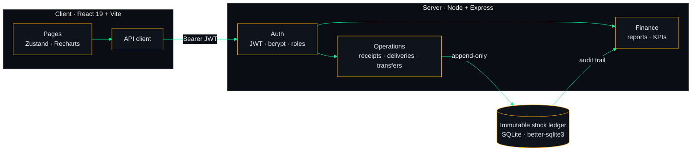

<!--
  ██╗   ██╗███████╗██████╗     ████████╗███████╗██████╗ ███╗   ███╗
  ██║   ██║██╔════╝██╔══██╗    ╚══██╔══╝██╔════╝██╔══██╗████╗ ████║
  ██║   ██║█████╗  ██║  ██║       ██║   █████╗  ██████╔╝██╔████╔██║
  ╚██╗ ██╔╝██╔══╝  ██║  ██║       ██║   ██╔══╝  ██╔══██╗██║╚██╔╝██║
   ╚████╔╝ ███████╗██████╔╝       ██║   ███████╗██║  ██║██║ ╚═╝ ██║
    ╚═══╝  ╚══════╝╚═════╝        ╚═╝   ╚══════╝╚═╝  ╚═╝╚═╝     ╚═╝
  VED.TERMINAL · @Destroyerved · you found the source. respect.
-->

  

  

  
  
  
   
  
  

## `00` &nbsp;Know Your Coder

  

## `01` &nbsp;Flagship Positions

  

### 📦 &nbsp;Inventra — ledger-grade inventory system

> Every unit of stock that moves gets written to an **immutable ledger**, the same discipline money needs. Multi-warehouse, role-gated, and auditable end to end.

- 🧾 **Append-only stock ledger** — full audit trail for every receipt, delivery and transfer
- 🔐 **Role-based access** — admin · manager · staff, with JWT sessions and bcrypt-hashed passwords
- 🏬 **Multi-warehouse** — SKUs, barcodes and per-location tracking
- 📈 **KPI dashboards & financial reporting** — low-stock alerts and Recharts visualisations
- 🐳 **Ships as one container** — Express serves the built React SPA; Dockerised for Render

  
  
  
  
  
  
  
  &nbsp;→&nbsp; <a href="https://github.com/Destroyerved/inventra-inventory-system"><b>view repo</b></a>

## `02` &nbsp;Watchlist

| Ticker | Position | Stack | Status |
|:--|:--|:--|:--:|
| `$INVT` | [**Inventra**](https://github.com/Destroyerved/inventra-inventory-system) Multi-warehouse inventory on an immutable ledger | `React` `Express` `SQLite` |  |
| `$PALM` | **PalmPayment** Payments — private repo, in active development | `classified` |  |
| `$GEOL` | [**GeoPulse LandGov**](https://github.com/Destroyerved/GeoPulse-LandGov) Detects land encroachment through satellite analysis | `JavaScript` |  |
| `$GEOP` | [**GeoPulse**](https://github.com/Destroyerved/GeoPulse) Real-time geospatial analytics for location viability | `JavaScript` |  |
| `$WARP` | [**WarPredict**](https://github.com/Destroyerved/WarPredict) Conflict prediction model | `Python` |  |
| `$LGLR` | [**Legal Redline**](https://github.com/Destroyerved/Legal-Redline-Env) Python environment for legal-document redlining | `Python` |  |
| `$AGRO` | [**AgroScore**](https://github.com/Destroyerved/AgroScore) Crop-viability scoring from soil, climate & market data | `JavaScript` |  |
| `$YOJN` | [**Yojana Vahaan**](https://github.com/Destroyerved/Yojana-Vahaan) Government-scheme discovery by eligibility · IAR Hackathon | `Hackathon` |  |
| `$CNCR` | [**CancerDetect**](https://vedresume.vercel.app/#projects) Deep-learning cancer-indicator detection with explainable AI | `Python` `XAI` |  |

## `03` &nbsp;Asset Classes

<table>
  <tr>
    <td><b><code>LANGUAGES</code></b></td>
    <td></td>
  </tr>
  <tr>
    <td><b><code>FRONTEND</code></b></td>
    <td>
       
      
      
      
      
    </td>
  </tr>
  <tr>
    <td><b><code>BACKEND &amp; DATA</code></b></td>
    <td>
       
      
      
      
    </td>
  </tr>
  <tr>
    <td><b><code>AI / ML</code></b></td>
    <td>
      
      
      
    </td>
  </tr>
  <tr>
    <td><b><code>SHIP</code></b></td>
    <td>
       
      
    </td>
  </tr>
</table>

## `04` &nbsp;Market Data

  
  

  
  

  <code>FUNDAMENTALS</code> · <code>PORTFOLIO ALLOCATION</code> · <code>STREAK</code> · <code>TRADING HOURS (IST)</code> — all live from GitHub

  

## `05` &nbsp;Ledger

| Txn | Entry | Memo |
|:--|:--|:--|
| `#0001` | 🎓 **B.Tech, Computer Engineering** | Class of 2028 |
| `#0002` | 💼 **Operations Executive & Recruiter** · Persistence | Runs hybrid teams across borders and fixes ops problems in real time |
| `#0003` | 🎮 **Gaming Head** · Computer Science & Gaming Club | Leads esports events and digital campaigns |
| `#0004` | 🏁 **9+ projects · 4+ hackathon prototypes** | Payments, ledgers, geospatial, AI |

<code>BALANCE ✓ RECONCILED</code>

## `06` &nbsp;Open a Position

  <b>Building something that moves money?</b> Let's talk.
    
  
  
  
  

  

